# Realtime-Ocean-Rendering-WebGL

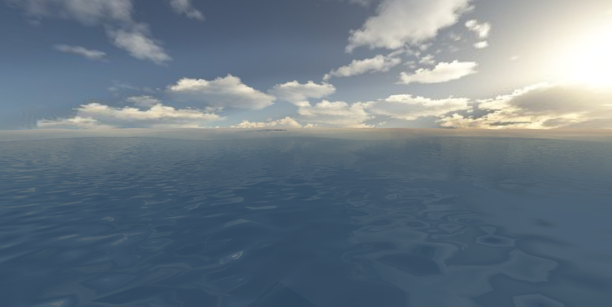

Members: 
* [Ricky Rajani](https://github.com/rickyrajani)
* [Wenli Zhao](https://github.com/wpchop)

[Live Demo](http://rickyrajani.com/Realtime-Ocean-Rendering-WebGL/)

### Overview
In this project, we implemented realistic real-time ocean wave rendering in WebGL 2.0, referencing [Realistic Real-time Rendering of Ocean Waves](https://www.microsoft.com/en-us/research/wp-content/uploads/2016/12/rtwave.pdf) and Simulating Ocean Water (Tessendorf 2001). 

We implemented realistic waves by generating a heightfield using Fast Fourier Transformations and a realistic lighting model which includes reflection, refraction, and alpha blending. In order to have an expansive ocean render in real-time, we
implemented view-dependent geometry wave geometry that has lower detail as we move away from the center of the ocean.

We also implemented procedural terrain using perlin noise in order to provide a sense of perspective to the ocean scene.

### Key Features

* FFT Height Map
* View Dependent Wave Geometry
* Lighting
* Procedural Terrain

### Milestone 1
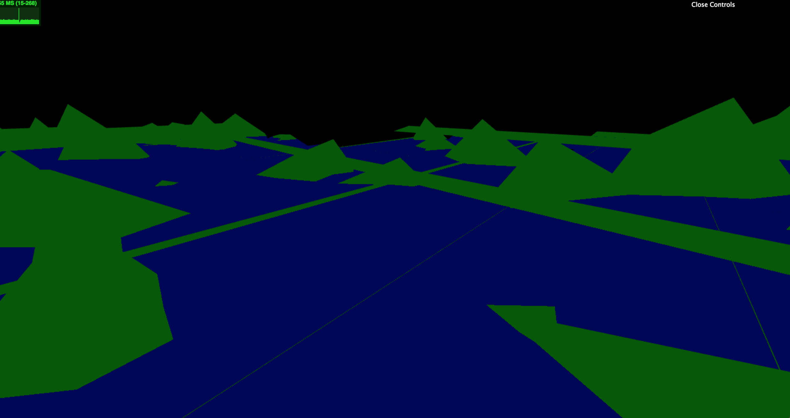
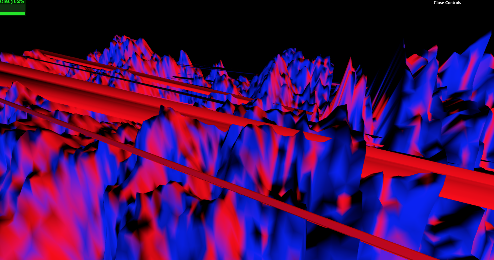
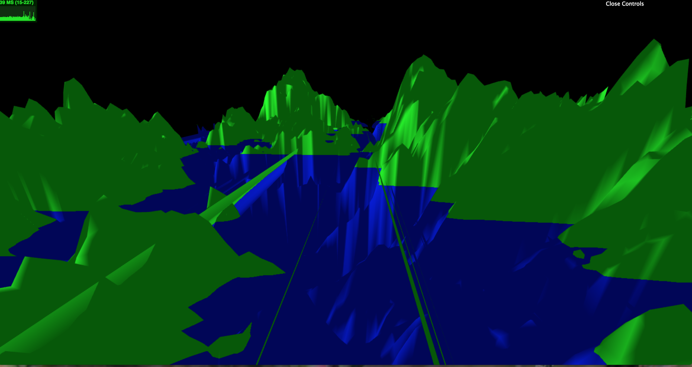

### Milestone 2
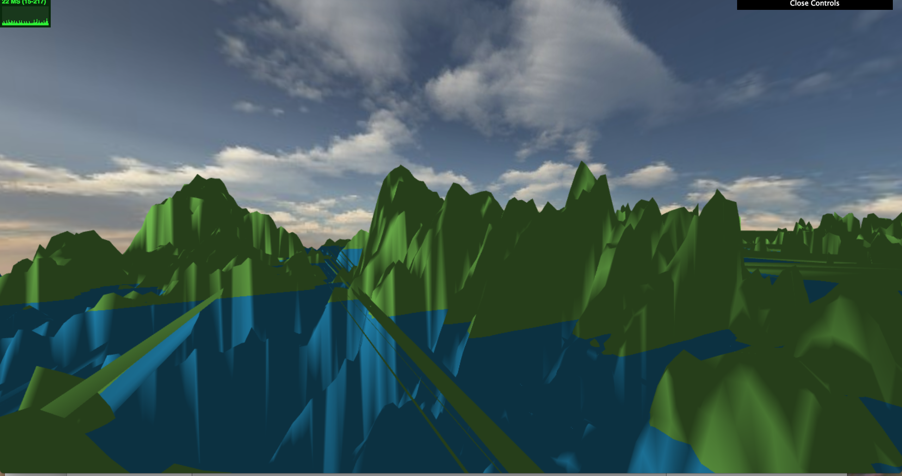
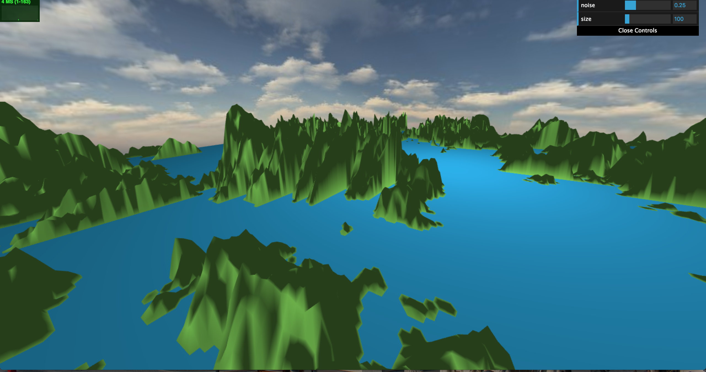

### Milestone 3
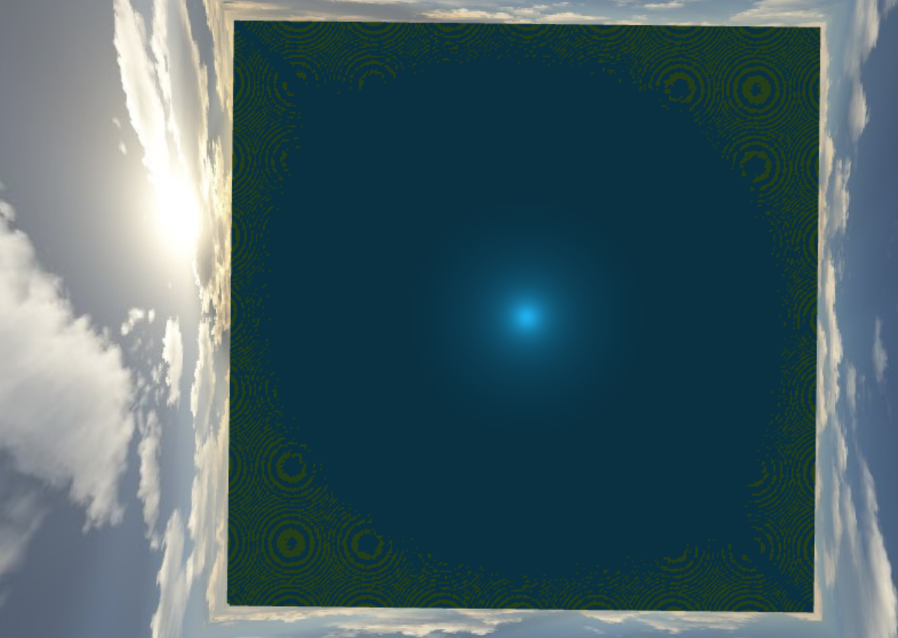
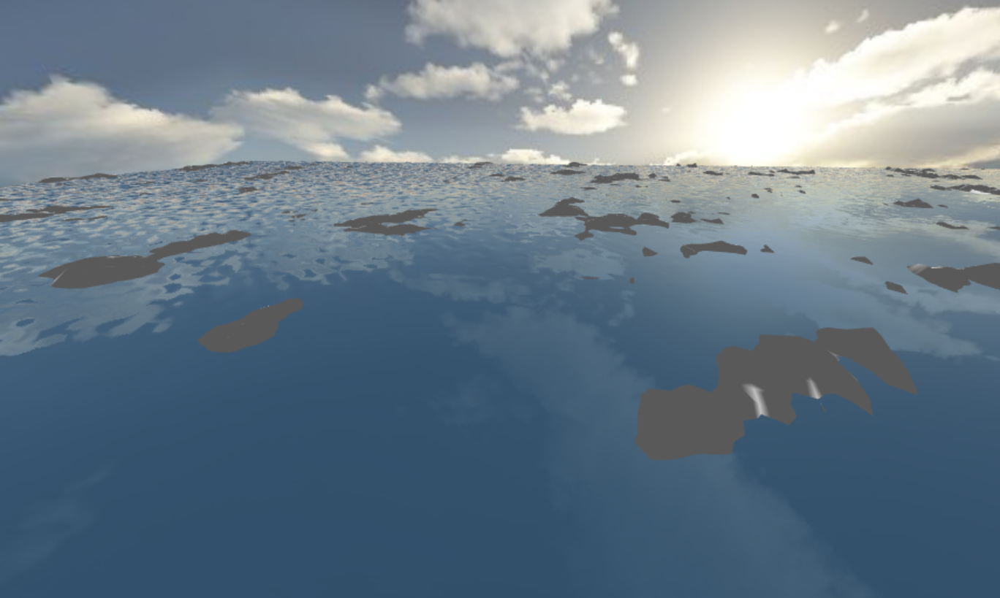
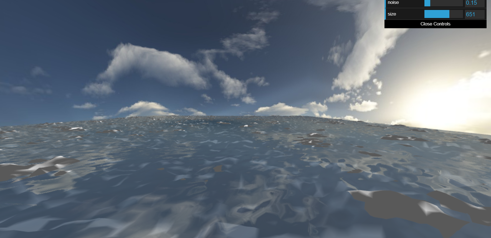

### Milestone 4
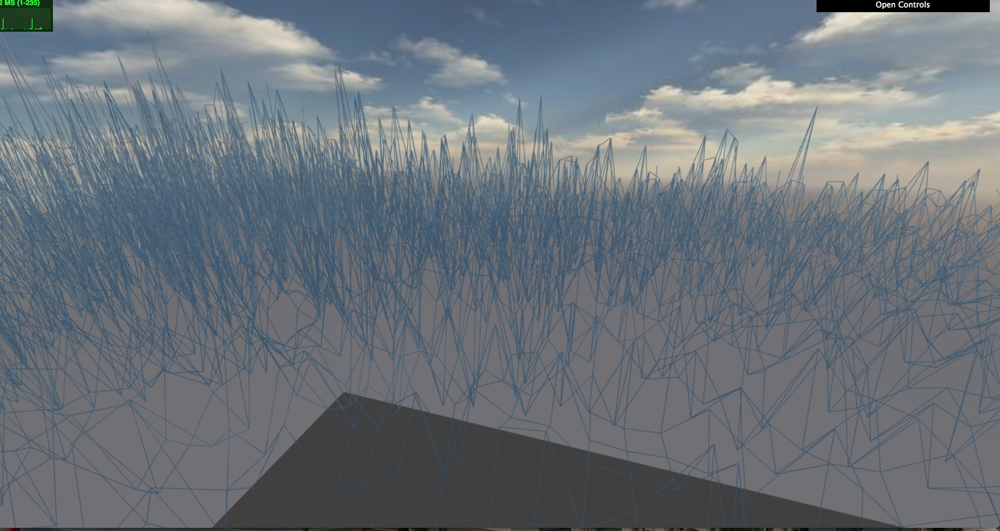
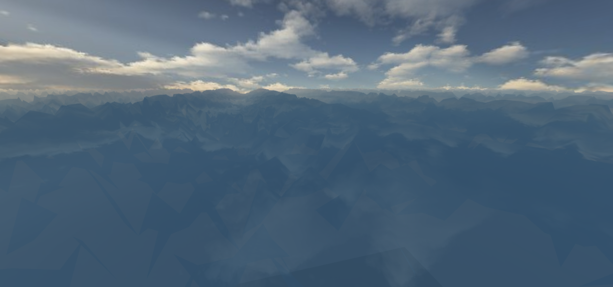
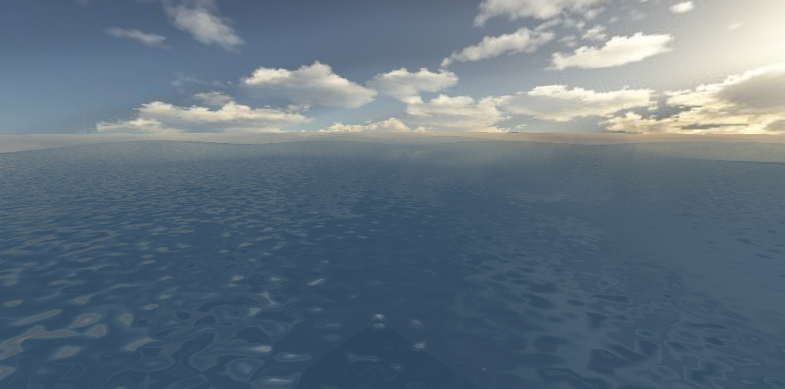

### Performance Analysis
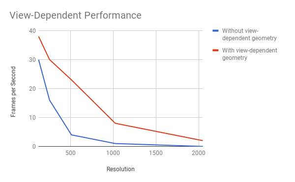

Our first major optimization was view-dependent geometry. In our scene, we construct the ocean plane as a square mesh. Our view-dependent geometry breaks this mesh down into nine square patches. The center patch of the ocean has a higher resolution and the surrounding patches are rendered at a lower resolution. In order to determine the performance gain from view-dependent geometry, we rendered the ocean at a high resolution for the entierty of the plane and compared it to a view-dependent construction. There was a significant performance gain as you can see in the graph above. As the resolution increased, the performance gain decreases.

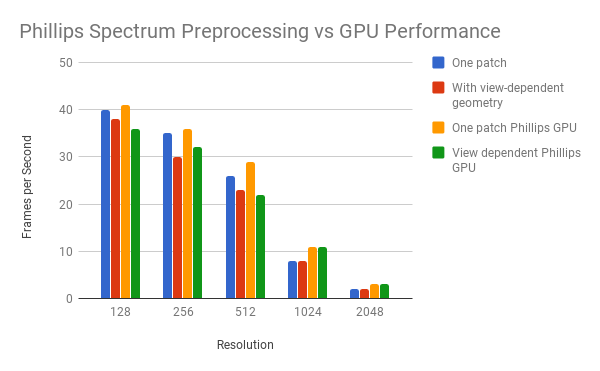

Our next attempted optimization was moving the calculation of the Phillips spectrum from the GPU to a preprocessing step on the CPU. The calculation of the Phillips spectrum included sampling random Gaussian distributions for two numbers and a number of exponential calculations that we thought would be costly on the GPU. Since the values only needed to be computed once for each point in the mesh, we thought that it would be faster as a preprocessing step. As you can see in the graph above, it was not a significant performance improvement. In some cases, the preprocessing took longer. This led us to look into our construction of the buffers.

We soon realized that we were creating some of our buffers and filling them for every frame, which was terrible for performance. After fixing up the creation of our buffers, we had a huge performance gain. For all resolutions up to and including 2048, we had a frame rate of greater than 60 fps.

Tested on: Windows 10 Pro, Intel Xeon CPU CPU E5-1630 v4 @ 3.70GHz 32GB, NVIDIA GeForce GTX 24465MB 

### Credits

* [Skybox Images](http://www.custommapmakers.org/skyboxes.php)
* [Skybox tutorial](http://math.hws.edu/eck/cs424/notes2013/webgl/skybox-and-reflection/skybox.html)
